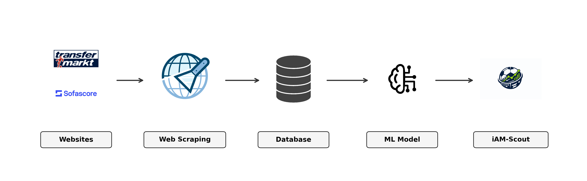
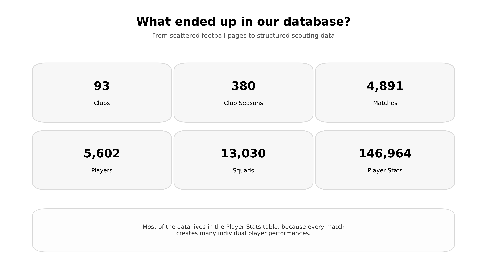
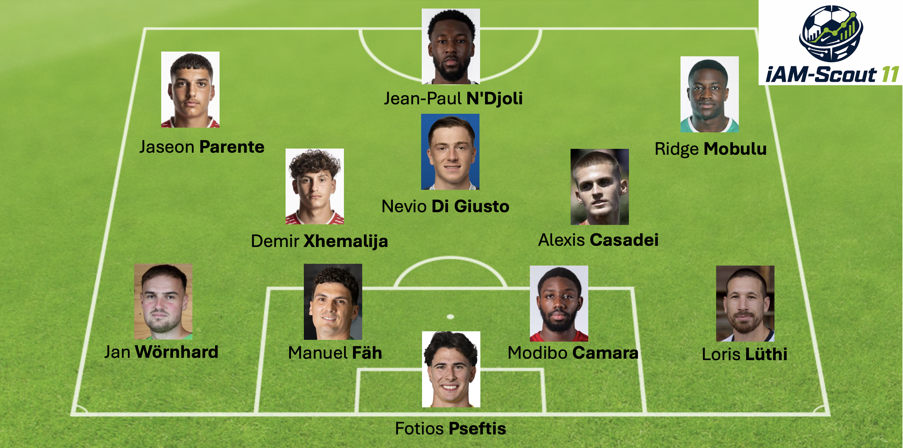

Imagine you want to find the next interesting player in Swiss amateur football. You open a match page, then a player profile, then another statistics table. After a while, your browser has twenty tabs open and the real comparison has not even started yet.

That is where **iAM-Scout** began.

> *Can we build a useful scouting prototype for Swiss amateur football using only publicly available data?*

We built a prototype that turns scattered information from [Transfermarkt](https://www.transfermarkt.ch/) and [Sofascore](https://www.sofascore.com/) into structured tables, estimated player ratings and concrete scouting ideas.

**In short, iAM-Scout goes from:**

- messy football websites  
- to clean database tables  
- to data-based player ratings  
- to an example scouting eleven  

 

## Goals: Scouting Without the Guesswork

Scouting is the **systematic process of observing, collecting, and analysing player performance** to identify talent and support better sporting decisions — and while this is **well established in professional football**, applying it to amateur football opens up new opportunities through publicly available data.
But manual scouting does not scale well.

A scout might remember one strong performance. Comparing hundreds of players across different clubs, leagues and seasons is much harder. Especially in Swiss amateur football, interesting players can easily disappear between match reports, browser tabs and handwritten notes.

**iAM-Scout is not meant to replace scouts.** It helps them decide *where* to look *first*.

The idea is simple: use public football data as a *first filter*. Instead of starting with a long list of unknown names, a club can start with players who already look interesting based on age, position, league context and performance data.

---

## Tables: From Messy Web Pages to Clean Data

The pipeline starts with public football websites. Since the data is not available as a ready-to-use dataset, a **web scraping** component collects information from match pages, player profiles and team pages.

After that, the raw data is cleaned and stored in a **PostgreSQL database**. This database became the **backbone of iAM-Scout**. It connects clubs, players, seasons, matches and player statistics, so that the models and the final application can actually work with the data.

For a scout, this matters because the data is no longer hidden across many separate pages. It can be filtered and compared in one structured system.

To make amateur players comparable, we first trained a **Rating Model** on professional Sofascore data, where real player ratings already exist, and then applied it to amateur match data to generate new estimated amateur ratings. For the **Recommender Model**, we aggregated each player’s stats from one season, including minutes, goals, assists, cards, starts and match results. The *target value* was the player’s average rating in the following season, allowing the system to recommend players based on both current performance and estimated future potential.

---

## Talents: The iAM-Scout 11

To make the idea more tangible, we created an example **iAM-Scout 11**. This lineup shows players that our recommender identified as promising suggestions.
The lineup is not a final ranking and not a complete scouting report. It is a starting point for discussion.

Some suggestions also look plausible beyond the numbers. For example, **Jean-Paul N'Djoli** has already moved to the **second-highest Swiss league**, while **Nevio Di Giusto** is now part of the **first team of FC Zurich** in the highest Swiss league.

Of course, iAM-Scout does **not** measure everything. It cannot see mentality, attitude, tactical intelligence or how a player behaves in training. But it can help ensure that promising players are not overlooked before a scout even gets to the pitch.

---

## Final Whistle

iAM-Scout shows that **data-driven scouting is possible in Swiss amateur football**, even when no perfect dataset exists.

The prototype turns public football pages into a structured scouting system and produces concrete player suggestions. For a small club, the value is simple: less time searching through browser tabs, more time watching the right players.

The hardest part was not the final model. It was the data journey before the model: collecting, cleaning, connecting and updating the information.

> *Good scouting does not have to start with a perfect dataset. Sometimes, it starts with messy web pages, a database and a good question.*

---

*Note: Generative AI tools were used to support language polishing and wording. The project content, implementation and interpretation remain the responsibility of the authors.*
