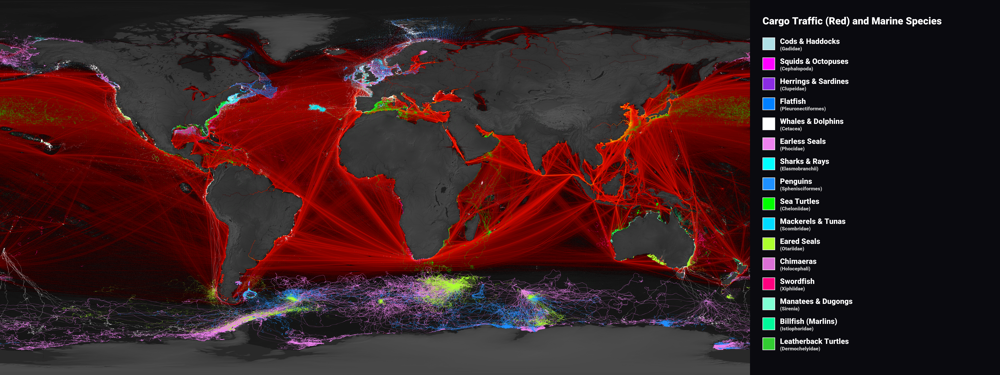

*What happens when you put 667 million ship pings and whale sightings on the same map? You find a hemisphere full of cargo, a hemisphere full of whales, and a machine learning model that quietly notices when something changes.*

## The Invisible Collision

More than [80% of global trade moves by sea](https://unctad.org/rmt2024). Cargo ships follow narrow industrial highways between the world's economic hubs. Whales, sharks, and sea turtles follow their own highways too: ancient migration routes between feeding and breeding grounds. Where these networks cross, the consequences are mostly invisible. Ship noise drowns out whale calls, and vessels strike animals that never appear in any report.

FinFlow makes that overlap visible. We built a platform that fuses nearly **667 million geospatial records** from two very different worlds: vessel tracking from [Global Fishing Watch](https://globalfishingwatch.org/) and biodiversity sightings from [OBIS](https://obis.org/), and puts the result on an interactive map.

## The Great Divide

Once everything rendered together, one pattern jumped out. We call it the **Great Divide**: industrial shipping is overwhelmingly concentrated in the Northern Hemisphere, while many of the planet's richest megafauna hotspots sit in the Southern Hemisphere, especially around Antarctic waters.

One thing to note: OBIS records are coastline-biased, because that's where the researchers and sensors are. So "biodiversity hotspot" partly means "hotspot of human observation."

## Pipeline at a Glance

Handling 667 million records breaks most off-the-shelf tools, so the architecture had to be carefully designed:

* **Ingestion.** A 4-node [Ray](https://www.ray.io/) cluster (64 CPUs, 192 GB RAM, 4× NVIDIA L4 GPUs) runs workers that download GFW and OBIS in parallel, tiling the globe and splitting time into 5-day windows.
* **Storage.** Everything lands in [Apache Parquet](https://parquet.apache.org/), partitioned by `year/month` for GFW and by category for OBIS.
* **Query.** [DuckDB](https://duckdb.org/) reads Parquet directly. No import step, no separate database server, just fast OLAP queries against the files.
* **Spatial join.** Coordinates from the two sources never line up exactly, so we snap both onto Uber's [H3 hexagonal grid](https://h3geo.org/) and join on cell index instead.

The hard lesson was memory. Early runs blew up the workers and forced a full cluster reboot. The fix was unglamorous: cap DuckDB at 18 GB per worker and process records in batches of 10,000 cells. Embedded query engines are fast, but in a shared cluster they need a leash.

## Detecting Interest Events with an LSTM

Static maps show *where* the conflict lives. To find *when* something unusual happens, we trained a multivariate [LSTM](https://en.wikipedia.org/wiki/Long_short-term_memory) on monthly aggregates of three signals per H3 cell: sighting counts, fishing hours, and boat pings. LSTMs fit because fishing seasons and marine migration are both strongly seasonal, and the network's memory state learns those cycles.

The setup:

* 12-month lookback predicting month 13; `input_size=3`, 128 hidden units in 2 layers, 0.2 dropout
* Adam, MSE loss, batch size 1024, learning rate 0.001
* Distributed training on 4× L4 GPUs via Ray Train
* Train 2012 to 2020, validate 2021 to 2022, test 2023 to 2025
* Early stopping at epoch 18, best validation at epoch 10

An *Interest Event* is just a large residual between predicted and actual values. We keep the top 0.5% to 1% of outliers and check them against real-world news. Two cases stood out:

* **Istanbul, August 2024.** A spike of +9,720 unexpected fishing hours near the Sea of Marmara, matching the *Palamut* mobilization: Turkish boats gathering ahead of the September 1st fishing ban lift, triggered early by an unusual Bonito migration.
* **Pingtan, China, January 2023.** A sharp cluster of distant-water vessels returning to port at once, the aftermath of US sanctions on Pingtan Marine Enterprise the month before.

The model knew nothing about bans, migrations, or sanctions. It just flagged the math.

## The Interactive Dashboard

The frontend is a [SvelteKit](https://kit.svelte.dev/) and TypeScript app rendering GPU-accelerated layers via [MapLibre GL](https://maplibre.org/) and [deck.gl](https://deck.gl/). [H3](https://h3geo.org) resolution adapts to zoom level. Anomalies render as red pins, and clicking one snaps every filter to that event's date and location.

DuckDB queries take several seconds, too long for a synchronous HTTP call. The [FastAPI](https://fastapi.tiangolo.com/) gateway uses a submit, poll, fetch pattern against the Ray cluster. Results come back as [Apache Arrow IPC](https://arrow.apache.org/) streams, roughly **5.8× more compact than equivalent JSON**, mapping straight to WebGL-friendly TypedArrays.

## Takeaways

A Ray, DuckDB, and Parquet stack scales to hundreds of millions of geospatial records on modest hardware, and pairing it with a temporal model turns dense telemetry into something a researcher can actually read. The Great Divide is real, though partly an artifact of where we look. The LSTM finds real-world events without ever being told about them.

Next up: live AIS streams and continuous anomaly scanning, so interest pins appear as events unfold. Curious to explore the data? Code and dashboard are on our [project page](https://github.com/BDP26/PM4-FinFlow).
