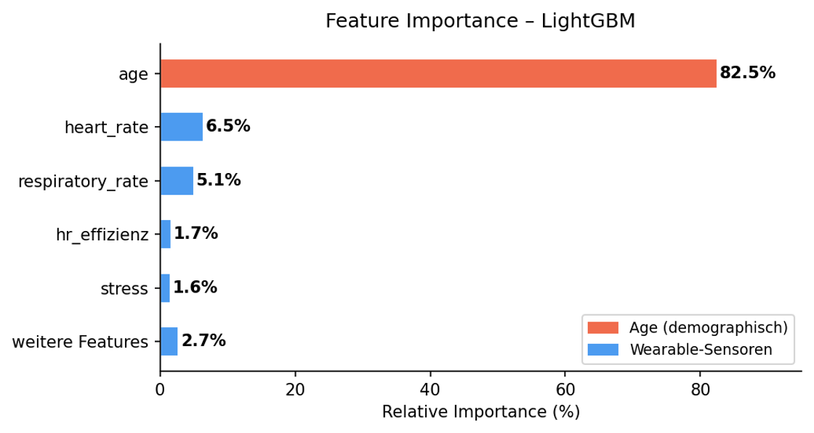
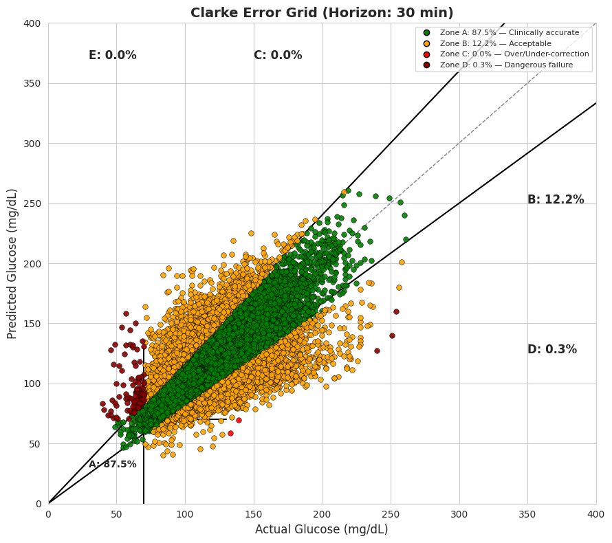

*ZHAW Data Science | PM4 - Big Data Projekt | Mai 2026*

Smartwatches wie die **Garmin Vivosmart 5** messen Herzfrequenz, Schlaf und Stress rund um die Uhr. Doch könnten solche Geräte in Zukunft noch mehr leisten als reines Fitness-Tracking? Unsere wissenschaftliche Arbeit untersuchte, ob Wearable-Daten Prädiabetes frühzeitig erkennen und Blutzuckerwerte verlässlich vorhersagen können.

## Das unsichtbare Risiko Prädiabetes

Prädiabetes beschreibt einen Zustand, bei dem der Blutzuckerspiegel bereits erhöht ist, ohne jedoch die Grenzwerte eines *Diabetes Typ 2* zu erreichen. 

*   **Das Problem:** Betroffene spüren meist absolut nichts, denn viele wissen jahrelang nichts von ihrem Risiko. Die Diagnose erfolgt heute meist erst über Bluttests in der Arztpraxis. Eine kontinuierliche, schmerzfreie Überwachung im Alltag fehlt.
*   **Die Chance:** Gerade dieses Stadium ist oft noch **vollständig umkehrbar**! Durch mehr Bewegung, gesündere Ernährung und Lebensstiländerungen lässt sich die chronische Erkrankung häufig verhindern.

> Hier setzt unser Projekt an: Können intelligente Algorithmen basierend auf Wearable-Sensordaten erkennen, ob sich im Körper eine Stoffwechselstörung entwickelt?

## Zwei Forschungsansätze

Unsere Untersuchung teilte sich in zwei komplementäre Bereiche:

> **1. Prädiabetes-Erkennung:** Kann eine gewöhnliche Smartwatch ein zuverlässiges Prädiabetes-Screening im Alltag ermöglichen und Nutzer frühzeitig warnen?

> **2. Blutzuckervorhersage:** Lassen sich zukünftige Blutzuckerwerte aus den Messwerten des Wearables präzise vorhersagen?

Während die Erkennung als Frühwarnsystem dient, hilft die Vorhersage des Blutzuckerspiegels dabei, den eigenen Lebensstil im Alltag anzupassen. Sie gibt Nutzern direktes, datenbasiertes Feedback darüber, wie ihr Körper auf bestimmte Aktivitäten oder Ruhephasen reagiert.

## Wie die KI die Sensordaten analysiert

Für die Erkennung von Prädiabetes haben wir ein KI-Modell namens **LightGBM** eingesetzt. Dieses Modell eignet sich besonders gut für unvollständige und komplexe Alltagsdaten. Analysiert wurden unter anderem:

* Herzfrequenz und Atemfrequenz
* Schlafphasen und Stresslevel
* Bewegungs- und Aktivitätsdaten

Das Modell erreichte zunächst eine Genauigkeit von **68.9 %**. Bei genauerer Analyse zeigte sich jedoch, dass vor allem das Alter der Testpersonen der entscheidende Faktor war. Statistisch gesehen haben ältere Menschen ein höheres Risiko für Prädiabetes. 

*Einfluss der unterschiedlichen Datenwerte auf die Vorhersage (Modell mit 68.9 % Genauigkeit)*

Da wir uns in unserer Forschung jedoch rein auf die Sensordaten der Smartwatch fokussieren wollten (ohne demografische Daten wie das Alter vorauszusetzen), haben wir das Alter in einem zweiten Schritt aus dem Modell entfernt. Das Ergebnis: Die Genauigkeit sank deutlich auf **47.5 %**.

> Das bedeutet im Klartext: Ohne den Faktor Alter verlor das Modell seine Vorhersagekraft und die Trefferquote sank unter die Schwelle eines reinen Zufallstreffers.

## Der biologische Rhythmus als Schlüssel

Erfolgreicher war unser zweiter Forschungsansatz: die Vorhersage zukünftiger Blutzuckerwerte über einen Zeitraum von 30 Minuten mittels eines **Quantile-XGBoost-Modells**. 

Der Durchbruch gelang uns durch zwei entscheidende Faktoren:

*   **Faktor 1: Die innere Uhr (Zirkadiane Merkmale)** 
    Jeder Messwert wurde mit der genauen Uhrzeit kombiniert. Da unser Körper einem biologischen 24-Stunden-Rhythmus folgt und sich je nach Tageszeit völlig anders verhält, war diese Information für die KI goldwert.
*   **Faktor 2: Der persönliche Fingerabdruck (Individuelle Referenzwerte)**
    Ein hoher Puls bedeutet nicht bei jedem das Gleiche. Wir haben für jede Person den Durchschnitt ihrer eigenen Messungen berechnet. So konnte das Modell viel besser beurteilen, ob ein aktueller Wert im *individuellen* Vergleich hoch oder niedrig ist.

> ### Das Ergebnis kann sich sehen lassen:
> Das Modell erreichte einen mittleren prozentualen Fehler (MAPE) von gerade einmal **9.14 %**! Die Vorhersagen wichen im Schnitt also weniger als zehn Prozent vom echten Blutzuckerwert ab. Für Menschen, die ihren Blutzucker im Auge behalten müssen, ist das ein riesiger Gewinn, um Trends im Alltag verlässlich abzuschätzen.

## Klinische Einordnung: Wann ist ein Fehler gefährlich

In der Medizin reicht eine gute statistische Genauigkeit alleine nicht aus. Mit Hilfe der sogenannten **Clarke Error Grid Analysis** lässt sich beurteilen, ob ein Messfehler für Patienten klinisch gefährlich wäre. Das Ziel ist es, dass möglichst 100 % der Vorhersagen in den sicheren Zonen A und B landen, da Fehler in diesen Bereichen keine falschen medizinischen Behandlungen auslösen würden.

*Clarke Error Grid Analysis zur Beurteilung des Risikos von Vorhersagefehlern und deren Auswirkungen auf therapeutische Entscheidungen*

Die Ergebnisse unseres Modells waren medizinisch extrem vielversprechend:

* **99.7 %** aller Vorhersagen lagen in den sicheren Zonen A und B
* Nur **0.3 %** wichen stärker ab
* Keine einzige Vorhersage führte zu einer gefährlichen Fehleinschätzung

## Ausblick

Stand heute ersetzen Smartwatches noch keine ärztliche Diagnose. Unsere Arbeit liefert jedoch einen starken **Proof of Concept** für ein digitales Frühwarnsystem. Um die Genauigkeit in Zukunft weiter zu steigern, wollen wir im nächsten Schritt erweiterte Deep-Learning-Modelle testen, um komplexe zeitliche Zusammenhänge noch besser zu verarbeiten.
