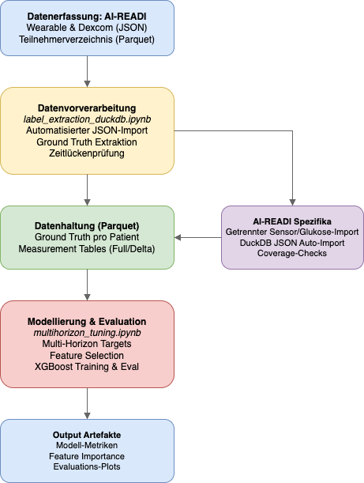
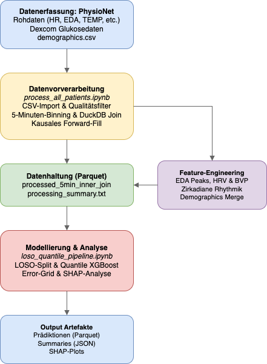

# Kann meine Garmin Diabetes erkennen? Unsere Spurensuche in Wearable-Daten
 
*Von Alex Smolders, Abishanth Jeyatheeswaran und Thierry Zürcher*
 
Smartwatches und Fitness-Tracker erfassen heute kontinuierlich physiologische Parameter wie Herzfrequenz, Atmung oder Sauerstoffsättigung – passiv und nicht-invasiv. Damit liegt die Frage nahe, ob sich diese Daten zur Früherkennung von **Prädiabetes** nutzen lassen: jenem reversiblen Zwischenstadium vor einem Typ-2-Diabetes, das in der Regel symptomlos verläuft.
 
Die kurze Antwort vorweg: Für eine zuverlässige Klassifikation reichten die Daten kommerzieller Smartwatches in unseren Analysen nicht aus. Mit klinischen Wearables liess sich der Blutzuckerwert hingegen mit überraschend hoher Präzision direkt vorhersagen.

## Zwei Forschungsfragen, zwei Datensätze
 
Wir haben das Problem in zwei komplementäre Forschungsfragen unterteilt:
 
1. **Lässt sich anhand kommerzieller Wearables eine zuverlässige Klassifikation zwischen gesunden und prädiabetischen Personen vornehmen?**
2. **In welchem Mass lässt sich der Blutzuckerspiegel anhand klinischer Wearable-Daten prädiktiv schätzen?**
Für die erste Frage nutzten wir den [AI-READI-Datensatz](https://fairhub.io/datasets/4) mit 61 Probanden, ausgestattet mit einer **Garmin Vivosmart 5**. Für die zweite Frage griffen wir auf einen [PhysioNet-Datensatz](https://physionet.org/content/big-ideas-glycemic-wearable/1.1.3/) zurück, der klinische Sensorik (**Empatica E4**) mit einem kontinuierlichen Glukose-Monitor als Referenzstandard kombiniert.

## Frage 1: Die Grenzen kommerzieller Sensorik
 
Aus den Garmin-Daten extrahierten wir Herzfrequenz, Atemfrequenz, Stresslevel, Aktivität und Sauerstoffsättigung. Auf dieser Basis trainierten wir einen **LightGBM-Klassifikator** sowie ein **LSTM-Netzwerk**.

Das erste Ergebnis wirkte vielversprechend: 68.9 % Accuracy. Eine Analyse der Feature-Importance zeigte jedoch, dass das einflussreichste Merkmal nicht ein physiologisches Signal war, sondern das **Alter**.
 
| Modell | Accuracy | AUC-ROC | F1-Score |
|---|---|---|---|
| LightGBM **mit** Alter | 68.9 % | 0.647 | 0.687 |
| LightGBM **ohne** Alter | 47.5 % | 0.469 | 0.442 |
| Zufallsklassifikation | 50.0 % | 0.500 | 0.500 |
 
Ohne das Merkmal Alter fiel die Modellleistung unter das Zufallsniveau. Das LSTM zeigte ein vergleichbares Muster.
 
Ein wesentlicher Grund liegt in der **Datenqualität**: ca. 10 % der Herzfrequenz-, 15 % der Atemfrequenz- und rund 90 % der Sauerstoffsättigungswerte fehlten. Um Akkulaufzeit zu sparen, unterdrücken die Geräte Messungen bei suboptimalem Hautkontakt oder Bewegung. Zudem sind die exportierten Daten stark aggregiert – feingranulare physiologische Muster gehen verloren.
 
**Antwort auf Frage 1:** Mit den aktuell verfügbaren Sekundärdaten kommerzieller Wearables ist eine verlässliche Klassifikation von Prädiabetes nicht möglich.

## Frage 2: Glukoseprädiktion mit klinischer Sensorik
 
Für die zweite Frage änderten wir das Setup: klinisch validierte Wearables mit höherer Auflösung und Rohdaten statt Sekundärsignale. Ziel war eine **quantitative Vorhersage** des Blutzuckerwerts mit einem Horizont von 30 Minuten.
 

Nach einem Vergleich mehrerer Verfahren entschieden wir uns für eine **Quantile-Regression auf Basis von XGBoost**. Im Unterschied zu klassischen Punktschätzungen liefert dieser Ansatz auch ein **Konfidenzintervall** – im klinischen Kontext wertvoll, da es therapeutische Entscheidungen absichert.
 
Ein zentraler Schritt war die Integration **zirkadianer Merkmale**: Die Uhrzeit wurde in Sinus- und Kosinus-Komponenten kodiert, sodass das Modell die zyklische Tagesstruktur des Glukosestoffwechsels korrekt abbilden konnte.

### Ergebnisse
 
Der mittlere **MAPE** lag bei **9.14 %**. Bei einem tatsächlichen Glukosewert von 100 mg/dL entspricht dies einer durchschnittlichen Vorhersage zwischen 91 und 109 mg/dL.
 
Zur Bewertung der klinischen Relevanz führten wir eine **Clarke Error Grid Analysis** durch – ein etabliertes Verfahren, das Vorhersagefehler in fünf Zonen klassifiziert (A: klinisch akkurat bis E: potenziell gefährlich):

 
- **Zone A:** 87.5 %
- **Zone B:** 12.2 %
- **Zone C/D:** 0.3 %
- **Zone E:** 0.0 %

Insgesamt lagen **99.7 % aller Vorhersagen in den klinisch sicheren Zonen** – ein Ergebnis, das die therapeutische Verwendbarkeit des Modells nahelegt.

## Einordnung
 
Die aggregierten Daten kommerzieller Fitness-Tracker reichen derzeit nicht aus, um Prädiabetes zuverlässig zu identifizieren. Klinisch validierte Wearables hingegen ermöglichen eine präzise und therapeutisch sichere Vorhersage des Blutzuckerwerts. Die zentrale Differenz liegt in der **Verfügbarkeit unverarbeiteter Rohdaten**.
 
Methodisch nehmen wir drei Erkenntnisse mit: Performance-Metriken können trügerisch sein, wenn man die Feature-Importance nicht prüft. Datenqualität ist entscheidender als Modellkomplexität. Und die explizite Quantifizierung der Modellunsicherheit ist im klinischen Kontext essenziell.

## Ausblick
 
Mit grösseren Probandenpopulationen liessen sich komplexere Architekturen wie Transformer-Netzwerke evaluieren. Vielversprechend ist auch die Integration statischer Parameter wie BMI oder familiärer Krankenhistorie. Solange jedoch kommerzielle Hersteller keine Rohdaten freigeben, bleibt das Potenzial der Smartwatch am Handgelenk weitgehend ungenutzt.
