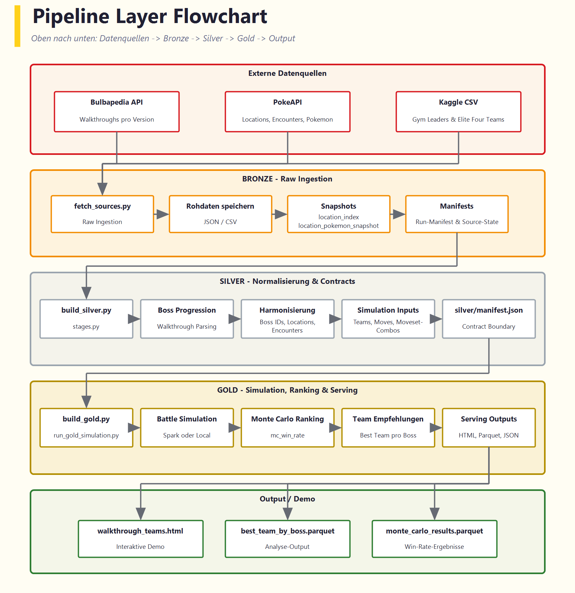
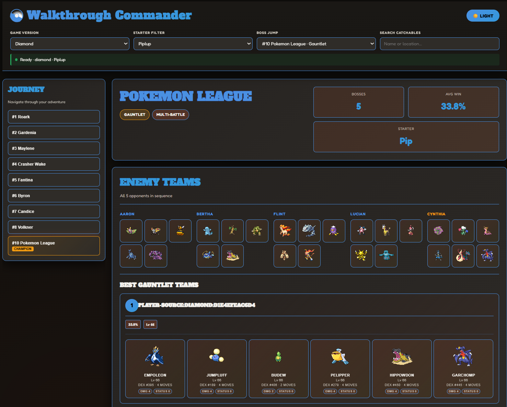

Beim Team-Building in Pokemon verlassen sich viele auf Bauchgefühl, Lieblingsmonster oder Tipps aus Foren. Unser Projekt stellt eine engere und praktischere Frage: Welches verfügbare Team hat in einer konkreten Spielsituation die beste Chance gegen den nächsten wichtigen Gegner?

Dafür haben wir eine Datenpipeline und einen Simulationsworkflow für 12 Hauptspiele der Generationen I bis VI aufgebaut. Ziel war nicht, die stärksten Pokemon allgemein zu bestimmen, sondern kontextabhängige Empfehlungen für Arenaleiter, Elite Four und Champions zu erzeugen.

## Verwendete Methoden

Unser Workflow kombiniert drei externe Quellen:

- **Bulbapedia** für Walkthrough-Struktur, Orte und Boss-Fortschritt
- **PokeAPI** für Pokemon-, Typen- und Attacken-Metadaten
- **Kaggle** für Datensätze zu Trainer- und Boss-Teams

Diese Eingaben laufen durch eine Pipeline im Medallion-Stil (`bronze -> silver -> gold`). In Silver werden Quelldaten vereinheitlicht und über unterschiedliche Schreibweisen, Spielversionen und Kontexte hinweg verknüpft. In Gold erzeugen wir gültige Kandidaten für Spieler-Teams, vergleichen sie mit Boss-Teams und ordnen sie nach simulierter Siegquote.

*Pipeline vom Rohdatenimport bis zu sortierten Team-Empfehlungen.*

Der Umfang des Projekts zeigt, warum sich die manuelle Teamwahl nur schwer optimieren lässt:

<table style="margin: 1rem auto;">
  <thead>
    <tr>
      <th>Beschreibung</th>
      <th style="text-align: right;">Wert</th>
    </tr>
  </thead>
  <tbody>
    <tr><td>Wichtige Boss-Kämpfe</td><td style="text-align: right;">176</td></tr>
    <tr><td>Fangbare Pokemon</td><td style="text-align: right;">451</td></tr>
    <tr><td>Attacken</td><td style="text-align: right;">412</td></tr>
    <tr><td>Orte und Routen</td><td style="text-align: right;">520</td></tr>
    <tr><td>Pokemon-Typen</td><td style="text-align: right;">18</td></tr>
  </tbody>
</table>

## Wie das Ranking funktioniert

Für jedes Szenario filtert das System zuerst nur die Pokemon, die zu diesem Zeitpunkt im Spiel auch wirklich verfügbar sind. Danach bildet es mögliche Teams und simuliert Kämpfe wiederholt gegen den gewählten Boss oder eine ganze Kampfserie. So entsteht eine stabilere Einschätzung der Teamqualität als bei einem einzelnen deterministischen Test.

Wenn ein Team zum Beispiel 450 von 500 Simulationen gewinnt, behandeln wir das als geschätzte Siegquote von 90 %. Das ist wichtig, weil Typenvorteile, Initiativreihenfolge und Attackenauswahl den Ausgang eines einzelnen Kampfes verändern können. Wiederholte Simulation bildet diese Unsicherheit deutlich besser ab als ein einmaliger Vergleich.

Das Typsystem ist dabei ein zentraler Einflussfaktor. Ein Team, das eine Wasser-Arena klar dominiert, kann später gegen einen Elektro- oder Drachen-Gegner schlecht abschneiden. Genau deshalb sind unsere Empfehlungen immer szenariospezifisch und nie universell.

## Visualisierung

Das Endergebnis wird in einer walkthrough-orientierten Ansicht dargestellt. Spielende wählen ein Spiel und ihr Starter-Pokemon aus, danach liefert die Oberfläche die stärksten verfügbaren Team-Empfehlungen für den nächsten wichtigen Kampf.

*Walkthrough-Ansicht mit kontextabhängigen Team-Empfehlungen.*

Diese Ansicht macht das Kernergebnis sichtbar: Das "beste" Team hängt davon ab, wo man sich im Spiel befindet, welchen Starter man gewählt hat und welche Pokemon vor dem nächsten Boss realistisch fangbar sind.

## Ergebnisse und Fazit

Das wichtigste Ergebnis ist einfach: Es gibt nicht das eine beste Pokemon-Team. Die Teamqualität hängt vom Spielfortschritt, von der Gegnerzusammensetzung und von Verfügbarkeitsgrenzen ab.

Das klingt zunächst offensichtlich, wird durch das Projekt aber messbar. Statt nur zu sagen, ein Team wirke stark, können wir unter festen Annahmen eine geschätzte Siegquote angeben. Das ist besonders nützlich für Elite-Four- und Champion-Szenarien, in denen ein Team mehrere starke Kämpfe nacheinander überstehen muss.

Das Projekt hat ausserdem gezeigt, dass die Datenintegration mindestens so anspruchsvoll war wie die Simulation selbst. Empfehlungen sind nur dann glaubwürdig, wenn Begegnungsdaten, Boss-Teams und Pokemon-Metadaten über alle Quellen hinweg sauber zusammenpassen.

Kurz gesagt macht das Projekt aus Team-Building in Pokemon ein reproduzierbares Analyseproblem. Es ersetzt die Entscheidung der Spielenden nicht, liefert dafür aber eine deutlich bessere Grundlage.

  

